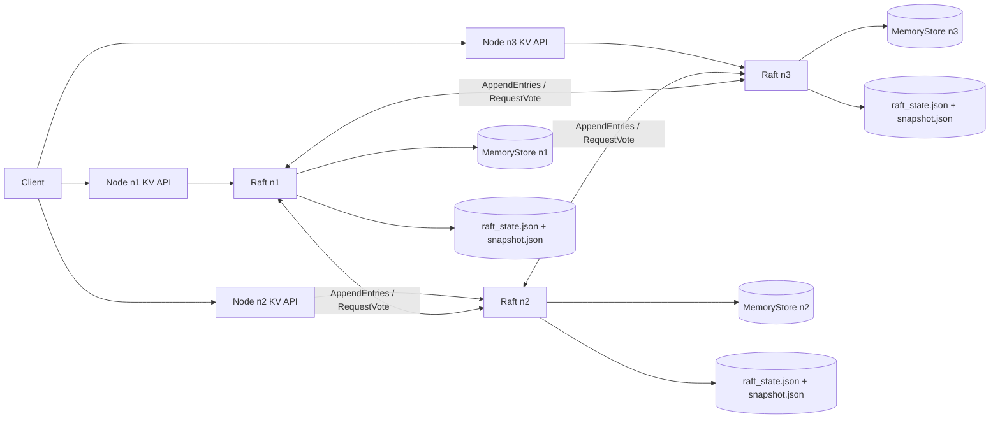

# Raft KV Store (Go)

A fault-tolerant distributed key-value store written in Go, implementing the Raft consensus algorithm with leader election, log replication, crash recovery, and snapshot-based log compaction.

Designed for correctness, safety under failure, and clear separation between client traffic and internal consensus communication.

## Architecture


## Core Capabilities
- Leader election using Raft.
- Log replication with `nextIndex` / `matchIndex` backtracking.
- Majority-based commit with current-term safety rule.
- Apply loop enforcing commit-gated state machine updates.
- Leader-only writes (`409 not_leader` with leader hint).
- Separate client API and internal Raft RPC ports.
- Thread-safe in-memory store (`sync.RWMutex`).

## Persistence & Crash Recovery
- Durable storage of:
  - `currentTerm`
  - `votedFor`
  - `log` (with compaction-aware base metadata)
- Restart recovery with log replay and snapshot restoration.
- Crash-before-commit safety guarantees.
- Strong write semantics (acknowledge success only after majority commit).

## Snapshot & Log Compaction
- Snapshot trigger threshold (`RAFT_SNAPSHOT_THRESHOLD`).
- Local snapshot persistence in `snapshot.json`.
- Log truncation after snapshot creation.
- Snapshot restoration on restart.

## Consistency Model
Writes are linearizable when a majority of nodes are reachable. Reads are served locally and may be stale during leader failover or follower catch-up.

## Design Decisions
- Client and Raft traffic use separate ports to avoid interference.
- Writes are rejected on followers instead of proxied, simplifying failure semantics.
- Persistence occurs before state exposure to ensure crash safety.
- Snapshotting uses base-index tracking to preserve Raft log index monotonicity.

## Requirements
- Go `1.25+`
- Windows PowerShell (scripts are `.ps1`)

## Configuration
Environment variables:
- `KVSTORE_PORT`: client API port (fallback `PORT`, default `8080`)
- `RAFT_PORT`: internal Raft RPC port (default `KVSTORE_PORT + 1000`)
- `NODE_ID`: node identity (default `node-<port>`)
- `PEERS`: comma-separated Raft peer URLs
- `RAFT_NODES`: alias for `PEERS`
- `PEER_IDS`: optional comma-separated peer IDs aligned with `PEERS`
- `RAFT_DATA_DIR`: base persistence directory; node ID is appended internally
- `RAFT_SNAPSHOT_THRESHOLD`: snapshot trigger threshold (default `50`)

Example single node:
```powershell
$env:NODE_ID="n1"
$env:KVSTORE_PORT="8081"
$env:RAFT_PORT="9081"
$env:PEERS=""
go run .
```

## Running a Local 3-Node Cluster
Start in separate terminals automatically:
```powershell
.\scripts\run-cluster.ps1
```

Default ports:
- `n1`: KV `8081`, Raft `9081`
- `n2`: KV `8082`, Raft `9082`
- `n3`: KV `8083`, Raft `9083`

## Expected Results
After startup:
1. Exactly one node is `leader`.
2. Other nodes are `follower`.
3. Follower write returns `409 not_leader` with leader hint.
4. Leader write returns `200` only after majority commit.
5. Reads converge on all nodes after replication/catch-up.

Check health:
```powershell
Invoke-RestMethod http://localhost:8081/health
Invoke-RestMethod http://localhost:8082/health
Invoke-RestMethod http://localhost:8083/health
```

Check Raft status:
```powershell
Invoke-RestMethod http://localhost:9081/raft/status
Invoke-RestMethod http://localhost:9082/raft/status
Invoke-RestMethod http://localhost:9083/raft/status
```

`/raft/status` includes:
- `state`, `term`, `leaderId`
- `commitIndex`, `lastApplied`
- `logLen`, `lastLogIndex`, `lastLogTerm`
- `logBaseIndex`, `logBaseTerm`
- `nextIndex`, `matchIndex` (leader)

## Client API
### `PUT /set`
Request:
```json
{"key":"name","value":"luffy"}
```

Leader success (`200`):
```json
{"ok":true,"message":"stored","key":"name"}
```

Follower response (`409`):
```json
{
  "ok": false,
  "error": "not_leader",
  "message": "not leader",
  "leaderId": "n2",
  "leader": "http://localhost:8082"
}
```

### `GET /get?key=<k>`
Success (`200`):
```json
{"ok":true,"key":"name","value":"luffy"}
```

Not found (`404`):
```json
{"ok":false,"message":"key not found"}
```

### `DELETE /delete?key=<k>`
Success (`200`):
```json
{"ok":true,"message":"deleted","key":"name"}
```

### `GET /health`
Returns node health and Raft role metadata.

## Internal Raft API
- `GET /raft/status`
- `POST /raft/appendentries`
- `POST /raft/requestvote`

## Operational Scripts
- Basic demo flow: `.\scripts\demo.ps1`
- A-H regression harness: `.\scripts\test-ah.ps1`
- Full runner: `.\scripts\test-week4.ps1`
- Follower restart catch-up (P1): `.\scripts\persistence-smoke.ps1`
- Leader crash/rejoin flow (P2): `.\scripts\day4-smoke.ps1`
- Uncommitted-write crash safety (P3): `.\scripts\test-week4-p3.ps1`
- Snapshot survives restart (S1): `.\scripts\test-day6-s1.ps1`

Expected full-runner result:
- each stage prints `PASS [...]`
- final line: `PASS: Full validation runner completed.`

## Validation Matrix
- `A1` PASS, `A2` PASS
- `B1` PASS, `B2` PASS
- `C1` PASS, `C2` PASS
- `D1` PASS
- `E1` PASS (optional conflict scenario)
- `F1` PASS, `F2` PASS
- `G1` PASS
- `H1` PASS
- `P1` PASS
- `P2` PASS
- `P3` PASS
- `S1` PASS

## Testing and Tooling
Run all tests:
```powershell
go test ./...
```

Race detector:
```powershell
go test -race ./...
```

Store benchmarks:
```powershell
go test ./store -bench=. -benchmem -run ^$
```

## Project Structure
```text
.
|-- api/
|   |-- kv_handlers.go
|   |-- raft_handlers.go
|   |-- middleware.go
|   `-- router.go
|-- config/
|   `-- config.go
|-- raft/
|   |-- types.go
|   |-- rpc.go
|   |-- transport_http.go
|   |-- http.go
|   |-- node.go
|   |-- persist.go
|   |-- node_apply_test.go
|   |-- node_replication_test.go
|   |-- replication_scenarios_test.go
|   |-- persist_test.go
|   |-- persistence_restart_test.go
|   `-- term_stepdown_test.go
|-- scripts/
|   |-- run-node.ps1
|   |-- run-cluster.ps1
|   |-- watch-leader.ps1
|   |-- day6-kill-leader-test.ps1
|   |-- demo.ps1
|   |-- test-ah.ps1
|   |-- persistence-smoke.ps1
|   |-- day4-smoke.ps1
|   |-- test-week4-p3.ps1
|   |-- test-day6-s1.ps1
|   `-- test-week4.ps1
|-- store/
|   |-- store.go
|   |-- provider.go
|   |-- memory.go
|   |-- errors.go
|   |-- memory_test.go
|   |-- concurrency_test.go
|   `-- bench_test.go
|-- utils/logger.go
`-- main.go
```

## Lessons Learned
1. Ordering matters in distributed systems: persist first, then expose behavior.
2. Apply logic must be commit-gated and monotonic, especially across restarts.
3. Stable-leader polling is essential to avoid flaky distributed tests.
4. Crash-safety claims are only credible with real kill/restart validation.
5. Snapshot/log-base index consistency prevents the majority of compaction bugs.
